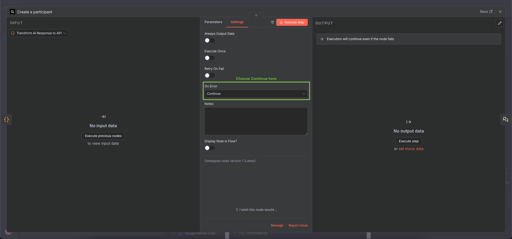
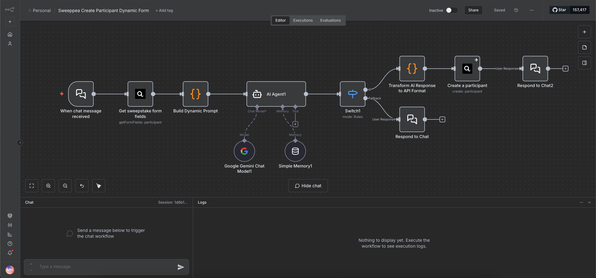
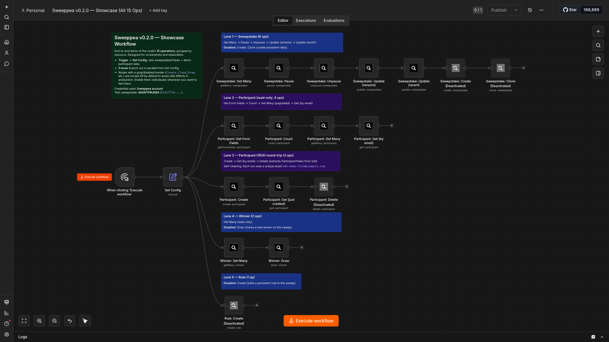
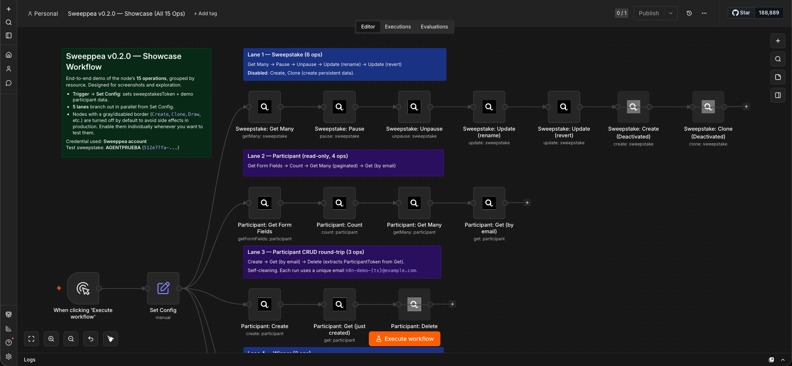
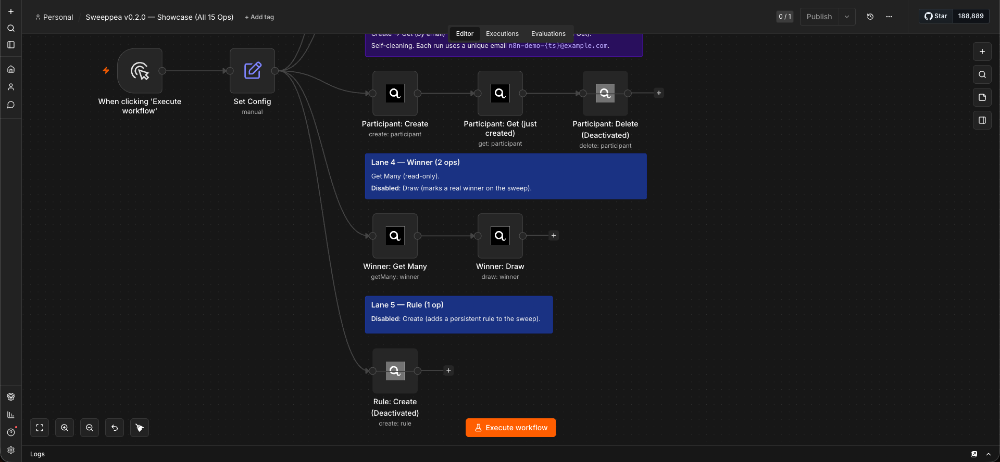

# Sweeppea Node for n8n

Community node for integrating Sweeppea sweepstakes platform with n8n workflows.

[Sweeppea](https://sweeppea.com) is a sweepstakes management platform that helps businesses create and manage promotional campaigns, contests, and giveaways.

[n8n](https://n8n.io/) is a [fair-code licensed](https://docs.n8n.io/reference/license/) workflow automation platform.

- [Installation](#installation)
- [Operations](#operations)
- [Credentials](#credentials)
- [Compatibility](#compatibility)
- [Usage](#usage)
- [AI Agent integration](#ai-agent-integration)
- [Example workflows](#example-workflows)
- [Resources](#resources)
- [Version history](#version-history)

## Installation

Follow the [installation guide](https://docs.n8n.io/integrations/community-nodes/installation/) in the n8n community nodes documentation.

## Operations

The node groups operations into four resources. Every operation uses the same Sweeppea API V3 credential.

### Participant

- **Count** — Aggregate counts (Participants / AMOE / Opt-Outs / Total) with optional date range
- **Create** — Register a new participant in a sweepstake with dynamic field support
- **Delete** — Remove a participant by `ParticipantToken`
- **Get** — Fetch a single participant by email, phone or token
- **Get Form Fields** — Retrieve the dynamic entry form fields for a sweepstake (useful for building chatbots or dynamic forms)
- **Get Many** — Paginated list of participants with search and date filters

### Sweepstake

- **Clone** — Duplicate an existing sweepstake (by Handler) with new dates and a new Handler
- **Create** — Create a new sweepstake (SMS / Email / Social) with handler and date window
- **Get Many** — Fetch every sweepstake on the authenticated account
- **Pause** — Pause an active sweepstake
- **Unpause** — Re-activate a paused sweepstake
- **Update** — Patch name, start/end dates or start/end times

### Winner

- **Draw** — Pick N winners using the weighted random algorithm, with optional group / spam / opt-out filters
- **Get Many** — Paginated list of previously drawn winners with optional search

### Rule

- **Create** — Submit an official rules HTML document for a sweepstake (first one is marked primary)

## Credentials

You'll need to configure your Sweeppea API credentials:

1. **API Token / API Key** — Your Sweeppea API authentication token
2. **Environment** — Select your target environment:
   - **Production** (`https://api-v3.sweeppea.com`)
   - **Development** (for local testing with a custom API URL)

### How to get your API credentials

1. Log in to your [Sweeppea Dashboard](https://app.sweeppea.com/api-dashboard)
2. Navigate to the **API Keys** tab
3. Generate or copy your API token
4. Use this token in the n8n credential configuration

The credential is tested against `POST /account/health-check`.

## Compatibility

- Requires **Node.js 22.16+**
- Tested with **n8n 2.20.x** and **n8n-workflow 2.16.x**
- Supports the n8n AI Agent through the `usableAsTool` flag

## Usage

### Dynamic field support

Each sweepstake can have different entry fields configured in the Sweeppea platform. Use **Participant → Get Form Fields** to fetch the schema, then **Participant → Create** to register data that matches it.

**Example flow:**

1. **Get Form Fields** — pull the required fields for a sweepstake.
2. Build a dynamic form (or AI chatbot) that collects the required data.
3. **Create** — register the participant with the collected data.

### Field name format

When submitting participant data, field names must use underscores instead of spaces — that is what Sweeppea expects on the wire:

- "First Name" → `First_Name`
- "How did you find us?" → `How_did_you_find_us?`

The body sent to `POST /participants/add` has this shape:

```json
{
  "lang"             : "EN",
  "source"           : "n8n-integration",
  "sweepstakesToken" : "uuid-v4-string",
  "entryPageFields"  : {
    "KeyEmail"       : "user@example.com",
    "KeyPhoneNumber" : "1234567890",
    "BonusEntries"   : 0,
    "Fields"         : {
      "First_Name"    : "John",
      "Last_Name"     : "Doe",
      "Email"         : "user@example.com",
      "Mobile_Number" : "1234567890",
      "Custom_Field"  : "value"
    }
  }
}
```

### Mandatory error handling for participant creation

When using **Participant → Create**, configure error handling at the node level:

1. Click on the Sweeppea node.
2. Go to the **Settings** tab (not Parameters).
3. Under **On Error**, change from "Stop Workflow" to **Continue**.



This lets the node pass error responses (duplicate entries, validation failures, etc.) as data to the next node so you can branch on them, instead of crashing the workflow. The 0.2.0 release standardises this behaviour across every operation — `Sweepstake not found` (404) and `Validation failed` (400) errors that previously short-circuited the workflow are now caught by the same `Continue On Fail` path.

## AI Agent integration

The node is registered with `usableAsTool: true`, so the n8n **AI Agent** node can discover and invoke any of its operations as a tool.

### Quick start (community nodes as tools)

On self-hosted n8n you may need to enable community-node tool usage. Set this environment variable on your n8n process:

```
N8N_COMMUNITY_PACKAGES_ENABLED=true
```

Then add a Sweeppea node to an AI Agent's tool list — n8n will expose every operation (e.g. `participant:create`, `winner:draw`) as a callable function.

> **Heads up:** Some n8n 2.x users have reported empty responses when the AI Agent V3 calls community-node tools. If you hit this and the verification matrix below stays green for direct workflow invocation, the MCP server below is a battle-tested alternative.

### Advanced: connect the MCP Client Tool

For Tier 2/3 operations not exposed by this node (Groups, Files, Notes, Calendar, Tickets, Billing, etc.) Sweeppea publishes a Streamable-HTTP MCP server at **`https://mcp.sweeppea.com`** (71 tools, v1.17.0+).

In n8n, add an **MCP Client Tool** node to your AI Agent with:

- **URL:** `https://mcp.sweeppea.com`
- **Transport:** Streamable HTTP
- **Auth:** Bearer (your Sweeppea API token, same one you use for the credential here)

The MCP Client and the Sweeppea node coexist — use the node for the deterministic Tier 1 flows above and the MCP for everything else, especially conversational / admin tasks.

## Example workflows

This package includes ready-to-import example workflows in the `/examples` folder:

### 1. Simple participant registration

**File:** `sweeppea-create-participant.json`


A straightforward workflow that collects participant data through an AI chatbot:

- AI Agent asks for First Name, Last Name, Email, and Mobile Number conversationally
- Transform node converts the collected data to Sweeppea API format
- Creates participant in the sweepstake

**How to use:**

1. Import the workflow JSON file into your n8n instance.
2. Configure your Sweeppea credentials.
3. Replace `YOUR_SWEEPSTAKES_TOKEN_HERE` with your actual sweepstakes token.
4. Activate the workflow.

### 2. Dynamic form registration

**File:** `sweeppea-create-participant-dynamic-form.json`



An advanced workflow that automatically adapts to any sweepstake configuration:

- Fetches the sweepstake form fields dynamically from the API
- Builds a custom AI system prompt based on the field configuration
- AI Agent collects all fields conversationally (even optional ones)
- Transform node dynamically maps collected data to API format
- Creates participant with all custom fields

**How to use:**

1. Import the workflow JSON file into your n8n instance.
2. Configure your Sweeppea credentials.
3. Replace `YOUR_SWEEPSTAKES_TOKEN_HERE` with your actual sweepstakes token (appears in two nodes).
4. Activate the workflow.

> The dynamic workflow automatically adapts to any sweepstake configuration, making it ideal for use across multiple campaigns with different field requirements.

### 3. v0.2.0 showcase — all 15 operations on one canvas

**File:** `sweeppea-showcase.json`
**Explainer:** [`sweeppea-showcase.md`](examples/sweeppea-showcase.md)

End-to-end demo that exercises every operation the node exposes, grouped by resource into 5 colour-coded lanes. Designed for screenshots, code review, and local QA.



A `Manual Trigger` feeds a `Set Config` node that stores the test `sweepstakesToken`, a per-execution unique email built from `$execution.id`, and the demo participant data. From there the flow fans out into:

- **Lane 1 — Sweepstake**: Get Many → Pause → Unpause → Update (rename) → Update (revert). Create and Clone are present but disabled (would persist data).
- **Lane 2 — Participant (read-only)**: Get Form Fields → Count → Get Many → Get (by email).
- **Lane 3 — Participant CRUD round-trip**: Create → Get (just created) → Delete. The chain cleans up after itself.
- **Lane 4 — Winner**: Get Many. Draw is disabled (would mark a real winner).
- **Lane 5 — Rule**: Create is disabled (would persist a rules document).

Top half of the canvas (Sweepstake + Participant read-only lanes):



Bottom half (CRUD round-trip, Winner, Rule):



After a successful run, every Sweeppea API call is verifiable in the Sweeppea dashboard: the test participants persist (with `n8n-demo-<execution.id>@example.com` as their email), the rename/revert round-trip leaves the sweepstake untouched, and Winner: Draw (when enabled) marks a real winner that shows up under the **Winners** tab.

**How to use:**

1. Import the JSON into your n8n instance (paste into the canvas or use the menu).
2. Re-bind the Sweeppea API credential on any one node — n8n will offer to apply it to the rest.
3. Replace the `sweepstakesToken` value in `Set Config` with one of your sweepstakes.
4. Click **Execute workflow**. A clean run lights 11 nodes green; the 4 disabled nodes stay grey.
5. To exercise a disabled op, click its toggle and execute again. Clean up the artefacts it creates from the Sweeppea dashboard.

### 4. Smart Registration v2 — conversational entry with live count

**File:** `sweeppea-smart-registration-v2.json`

Evolution of the v0.1 dynamic-form pattern with two new touches from v0.2.0:

- **`Participant: Count`** runs before the AI conversation, so the bot can tell the user *"you'll be participant #N+1 once registered"* in real time.
- **`Participant: Get Form Fields`** still drives the dynamic field collection, but the AI Agent's system prompt is rebuilt every turn with the current count baked in.

Flow:

```
Chat → Count → Get Form Fields → Build Dynamic Prompt → AI Agent → Switch
                                                                      ├─ ready → Transform → Register → Reply (success/duplicate/error)
                                                                      └─ continue → Reply (next question)
```

The AI Agent collects required fields one at a time, validates email/phone, and emits a JSON action when ready. A Code node maps that JSON onto the `participant:create` body shape exactly the way the v0.1 example did, so existing prompt engineering carries over.

### 5. Customer Self-Service — read-only chatbot with Sweeppea tools

**File:** `sweeppea-customer-self-service.json`

A chat agent for **participants** of an existing sweepstake. The AI Agent has three Sweeppea nodes attached as tools (all read-only, no destructive ops):

- **check_entry** — `Participant: Get` by email (answers *"am I in?"*)
- **entry_count** — `Participant: Count` (answers *"how many people entered?"*)
- **winners_list** — `Winner: Get Many` (answers *"who won?"*)

Each tool uses n8n's `$fromAI()` for parameters the agent should fill (e.g. the email for `check_entry`), with the `sweepstakesToken` hard-coded since a self-service bot serves a single sweep.

> Pick a chat model that reliably handles multi-step tool-calling. Smaller models may loop without ever invoking the tools.

### 6. Admin Command Bot — destructive ops by chat ⚠️

**File:** `sweeppea-admin-command-bot.json`

For the sweepstake **owner**, not for participants. Five Sweeppea tools attached, including destructive ones:

- **list_sweeps** — `Sweepstake: Get Many` (no params, safe)
- **pause_sweep** / **unpause_sweep** — `Sweepstake: Pause` / `Unpause`
- **rename_sweep** — `Sweepstake: Update` (name only)
- **draw_winners** — `Winner: Draw` (DESTRUCTIVE, marks real winners)

The system prompt instructs the agent to confirm before any destructive action ("Are you sure you want to draw 3 winners from sweep X?") and to refer to sweeps by their handler/name rather than just the token. Run it against a test sweepstake until you trust the conversation flow.

### Dev-mode note

If you're testing one of these workflows under `n8n-node dev` (the local development mode of `@n8n/node-cli`), n8n registers the package under the `CUSTOM.` namespace instead of `n8n-nodes-sweeppea.`. After importing, do a find-replace in the workflow JSON:

```
n8n-nodes-sweeppea.sweeppea     → CUSTOM.sweeppea
n8n-nodes-sweeppea.sweeppeaTool → CUSTOM.sweeppeaTool
```

Users who install the node via `npm i n8n-nodes-sweeppea` don't need this — the published types work directly.

## Resources

- [n8n community nodes documentation](https://docs.n8n.io/integrations/community-nodes/)
- [Sweeppea Platform](https://sweeppea.com)
- [Sweeppea API V3 Documentation](https://apidocs.sweeppea.com)
- [Sweeppea MCP Server Documentation](https://mcpdocs.sweeppea.com)

## Version history

### 0.2.3

- **AI Agent tool-mode fix for `Participant → Create`**. The body inputs (`Email`, `Phone Number`, `Bonus Entries`, `Custom Fields`, plus `Language` / `Source` under a new `Create Options` collection) are now exposed as top-level node parameters, so an AI Agent can fill them via `$fromAI()` when the Sweeppea node is used as a tool.
- Backwards compatible with v0.1 / v0.2 workflows: when the new parameters are left at their defaults (empty string / `0` / `{}`), the operation falls back to `items[i].json` exactly as before. The `Additional Fields → Use Input Data` toggle and the `entryPageFields` payload shape (underscored keys like `First_Name`) are unchanged.
- Priority order: explicit node parameter > input item field > hardcoded default.

### 0.2.2

- Addresses n8n community-node review feedback (no runtime behavior change):
  - Removed the dead `requestDefaults` block from the node description. This node is programmatic (`execute()`); every request already resolves its full URL through `sweeppeaApiRequest` → `httpRequestWithAuthentication`, so `requestDefaults` (a declarative-style config) was never consumed.
  - Codex `nodeVersion` set to the fixed schema value `"1.0"` (it is unrelated to the package's runtime version).
  - Codex `categories` reduced to supported values only: `Marketing & Content`, `Sales`, `Data & Storage`.

### 0.2.1

- Adds a GitHub Actions publish workflow (`.github/workflows/publish.yml`) that runs lint + build and publishes to npm with **provenance attestation** on every `v*.*.*` tag push. Required for the n8n Verified Community Nodes program (effective May 1, 2026).
- No functional changes versus 0.2.0; this release exists so the published package carries a provenance signature.

### 0.2.0

- New build system based on `@n8n/node-cli` (TypeScript 5.9, ESLint 9, flat config); the legacy regex transpiler is gone.
- Modular code layout under `nodes/Sweeppea/{descriptions,operations}/` plus a shared `GenericFunctions.ts` helper.
- New resources and operations:
  - **Participant**: Count, Get, Get Many, Delete (plus the existing Create and Get Form Fields)
  - **Sweepstake**: Clone, Create, Get Many, Pause, Unpause, Update
  - **Winner**: Draw, Get Many
  - **Rule**: Create
- AI Agent support via `usableAsTool: true`.
- Unified error handling: all API failures are mapped to `NodeApiError` / `NodeOperationError`, and `Continue On Fail` now applies consistently to every operation (including 404 on Get Form Fields, which previously short-circuited even with the flag on).
- Credential icon added (no change to credential schema; previously stored credentials keep working).
- Requires Node.js 22.16+.

### 0.1.x

- Initial release with `Participant → Get Form Fields` and `Participant → Create`.
- Dynamic field loading based on sweepstake configuration (API V3).
- Multi-environment support (production, development).
- AI chatbot integration support.

## License

[MIT](LICENSE)

---

© 2026 Sweeppea Development Lab
