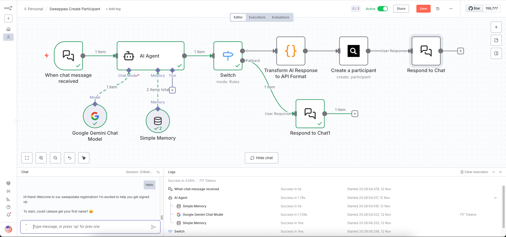
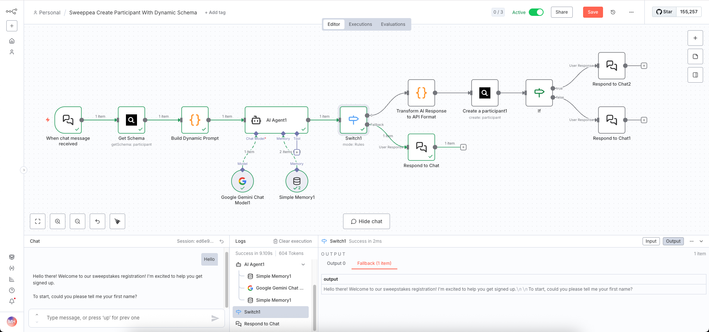

# Sweeppea Node for n8n

Community node for integrating Sweeppea sweepstakes platform with n8n workflows.

[Sweeppea](https://sweeppea.com) is a sweepstakes management platform that helps businesses create and manage promotional campaigns, contests, and giveaways.

[n8n](https://n8n.io/) is a [fair-code licensed](https://docs.n8n.io/reference/license/) workflow automation platform.

[Installation](#installation)
[Operations](#operations)
[Credentials](#credentials)
[Compatibility](#compatibility)
[Usage](#usage)
[Resources](#resources)
[Version history](#version-history)

## Installation

Follow the [installation guide](https://docs.n8n.io/integrations/community-nodes/installation/) in the n8n community nodes documentation.

## Operations

### Participant

- **Get Schema** - Retrieve the dynamic entry form fields for a specific sweepstake (useful for building chatbots or dynamic forms)
- **Create** - Register a new participant in a sweepstake with dynamic field support

## Credentials

You'll need to configure your Sweeppea API credentials:

1. **API Token/Key** - Your Sweeppea API authentication token
2. **Environment** - Select your target environment:
   - Production (https://api.sweeppea.com)
   - Development (for local testing with custom API URL)

### How to get your API credentials

1. Log in to your Sweeppea account
2. Navigate to Settings → API Credentials
3. Generate or copy your API token
4. Use this token in the n8n credential configuration

## Compatibility

- Minimum n8n version: 0.199.0
- Tested with n8n version: 1.0.0+

## Usage

### Dynamic Field Support

The Sweeppea node supports fully dynamic form fields. Each sweepstake can have different fields configured in the Sweeppea platform, and the node automatically adapts to these fields.

**Example workflow:**

1. Use **Get Schema** operation to fetch the required fields for a sweepstake
2. Build a dynamic form or chatbot that collects the required data
3. Use **Create** operation to register the participant with the collected data

### AI Chatbot Integration

This node works seamlessly with AI agents (OpenAI, Anthropic, etc.) to create conversational participant registration flows:

1. Fetch sweepstake schema
2. Build dynamic system prompt with required fields
3. AI agent collects data conversationally
4. Transform AI response to API format
5. Create participant automatically

### Field Name Format

When submitting participant data, field names should use underscores instead of spaces:
- "First Name" → `First_Name`
- "How did you find us?" → `How_did_you_find_us?`

The node expects data in this format:

```json
{
  "KeyEmail": "user@example.com",
  "KeyPhoneNumber": "1234567890",
  "BonusEntries": 0,
  "Fields": {
    "First_Name": "John",
    "Last_Name": "Doe",
    "Email": "user@example.com",
    "Mobile_Number": "1234567890",
    "Custom_Field": "value"
  }
}
```

## Example Workflows

This package includes ready-to-import example workflows in the `/examples` folder:

### 1. Simple Participant Registration
**File:** `sweeppea-create-participant.json`



A straightforward workflow that collects participant data through an AI chatbot:
- AI Agent asks for First Name, Last Name, Email, and Mobile Number conversationally
- Transform node converts the collected data to Sweeppea API format
- Creates participant in the sweepstake

**How to use:**
1. Import the workflow JSON file into your n8n instance
2. Configure your Sweeppea credentials
3. Replace `YOUR_SWEEPSTAKES_TOKEN_HERE` with your actual sweepstakes token
4. Activate the workflow

### 2. Dynamic Schema Registration
**File:** `sweeppea-create-participant-dynamic.json`



An advanced workflow that automatically adapts to any sweepstake configuration:
- Fetches the sweepstake schema dynamically from the API
- Builds a custom AI system prompt based on required fields
- AI Agent collects all fields conversationally (even optional ones)
- Transform node dynamically maps collected data to API format
- Creates participant with all custom fields

**How to use:**
1. Import the workflow JSON file into your n8n instance
2. Configure your Sweeppea credentials
3. Replace `YOUR_SWEEPSTAKES_TOKEN_HERE` with your actual sweepstakes token (appears in 2 nodes)
4. Activate the workflow

**Note:** The dynamic workflow automatically adapts to any sweepstake configuration, making it ideal for use across multiple campaigns with different field requirements.

## Resources

- [n8n community nodes documentation](https://docs.n8n.io/integrations/community-nodes/)
- [Sweeppea Platform](https://sweeppea.com)
- [Sweeppea API Documentation](https://api.sweeppea.com/docs)

## Version history

### 0.1.0 (2025-01-11)

**Initial Release**

- Dynamic field loading based on sweepstake configuration (API v3)
- Support for Get Schema operation
- Support for Create Participant operation
- Multi-environment support (production, development)
- Automatic field validation
- Support for multiple field types:
  - Text fields
  - Email
  - Phone numbers (US format)
  - Dates/Birthdate
  - Numbers
  - Select lists
- AI chatbot integration support

## License

[MIT](LICENSE.md)

---

© 2025 Sweeppea Development Lab
